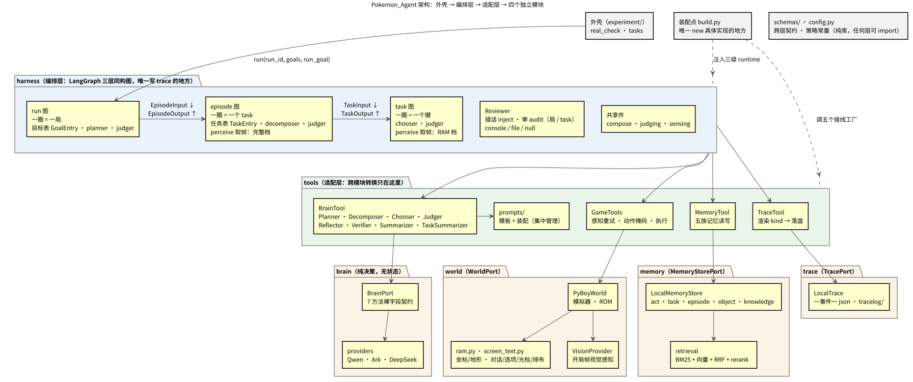
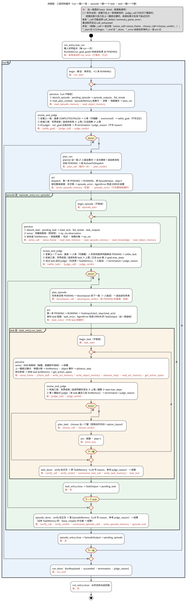
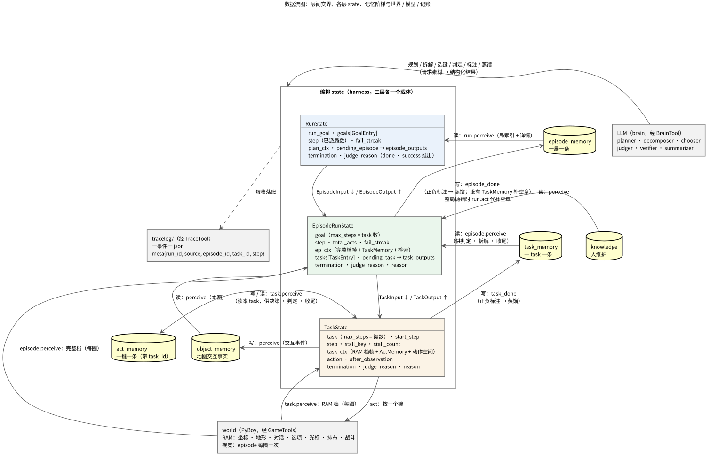

# 项目总览：用 harness 驱动无状态大脑玩《宝可梦 红》

> 最后更新：**2026-09-24**（CHANGELOG 195–203）。三张图的源文件在 `diagrams/*.puml`，
> 渲染产物同目录（`*.svg` / `*.png`）；改图改 `.puml`，再用 PlantUML 重新渲染。

## 一、要验证什么

一套**通用 harness**（控制循环 + 记忆 + 记账）驱动一个**无状态大脑**（只读参数、
只吐结构化结论的 LLM 调用集合）去玩通《宝可梦 红》，**全程不更新任何模型权重**。
要验证的是：长程任务里，**结构化的 episodic 记忆**与**分层的控制流**能不能替代
"把一切塞进一个大 prompt"——模型每次只做一件小事，其余一切由代码持有。

## 二、核心想法

1. **大脑无状态，状态全在外面。** brain 的每个方法只收裸字段、只吐自己的方言；
   跨步骤的东西一律在 harness 的 state、记忆库与 trace 里。换模型、重放、恢复都
   因此成立。
2. **三层同构的控制循环。** run（一圈 = 一局）、episode（一圈 = 一个 task）、
   task（一圈 = 一个键）是**同一副骨架**：

       perceive → review_and_judge ─done→ *_done
                         └─否则→ plan_* → act → 回 perceive

   - `act` 只执行：run / episode 从表里派一条（标 RUNNING）、跑下层子图，把结算写进
     `pending_episode` / `pending_task`；task 按一个键；
   - `perceive` 吸收上一圈的后果，**取帧**（episode 完整档、task RAM 档），**读直属下一级的记忆**
     与世界事实，装好本圈的上下文；本层其余各格只用这份上下文，不自己查库；
   - `review_and_judge` 先**定案**上一条（run 定上一局、episode 定上一个 task：盖章 → 人审可推翻
     → 记盖章账），再判停（机械三类 + 问模型）——**唯一的停机点**；
   - `plan_*` 只管"下一步做什么"（目标表 / 任务表 / 一个键），不判停；
   - `*_done` 标 → 蒸 → 结：把 perceive 读到的下级记录带正负标注蒸成一条记忆，
     由 LLM 写结论 `reason`，再出结算。
3. **每层独立计数、独立预算。** run 数局、episode 数 task、task 数键；
   `Task.max_steps` 的单位随所在层变。机械三类在三层同构：

   | 层 | 世界结束 | 停摆 | 预算尽 |
   |---|---|---|---|
   | run | 上一局终局帧 `obs.done` | 连续失败局 ≥ `RUN_STALL_LIMIT` | 已派局数 ≥ `RUN_MAX_EPISODES` |
   | episode | 当前帧 `obs.done` | 连续失败 task ≥ `EPISODE_STALL_LIMIT` | 已派 task ≥ `goal.max_steps` |
   | task | 当前帧 `obs.done` | 连续同键无变化 ≥ `STALL_LIMIT` | 已按键 ≥ `task.max_steps` |

   **只存 `termination`**（枚举）：停没停（`done`）、成没成（`success`）都由它推出，不存第二份。
   判停时 `review_and_judge` 另写 `judge_reason`（判定依据：判定员的理由 / 机械判停类别）；它与
   `*_done` 里 LLM 写的 `reason`（结论：停在哪、差在哪）分开，判定员以后换成别的模型也不会混。
4. **感知边界清楚：每层只有 perceive 取帧，档位按层。** episode 每圈（每个 task 前后）用完整档
   （内存 + 视觉），拆解与判定据此看懂局面；task 每圈用 RAM 档：坐标、地形、地标、战斗标志，
   以及从屏幕 tile 缓冲解码出的**对话、选项、光标与选单排布**（`screen_text.py`）。
   入口不取帧，上层也不向下层传帧——task 的开局帧由它自己第一圈取。
5. **记忆阶梯，每层只读直属下一级。** act（一键一条，源记录）→ task（一 task 一条）→
   episode（一局一条）。上两级是下一级**连同 verify 正/负标注**的蒸馏——负样本
   是教训，同样送进去。task 只读本 task 的 ActMemory，episode 只读本局的 TaskMemory，
   run 只读 EpisodeMemory；另加世界事实（物件、知识）。`knowledge` 由人维护。
   成败、步数、终止类别一律读来源章，不从正文反推。
6. **控制流归代码，人可随时介入；表为准。** 模型只提议；目标表（`GoalEntry`）与任务表
   （`TaskEntry`）共用一个状态枚举 `EntryStatus`，`COMPLETED` / `FAILED` 由 harness 盖章。
   goal 失败不自动重派，重试是规划的显式决定；task 只派一次，失败后同一版剩下的条目被放弃、
   从当前局面重拆。人在两处盖章前可推翻（`overturned` + 理由），在规划、拆解、判定处可插话。
   **定案以表为准**，记忆的章保留机器判定。
7. **每格都落账，可按任一层切片。** 一事件一 json，`meta` 五件
   `{run_id, source, episode_id, task_id, step}`；上层账的空位放本层 id。
   模型调用（`*_call`）与定稿结论（`*_verdict`）分两本账。
8. **四个独立模块，一座桥。** brain / world / memory / trace 各自只暴露一个 Port、
   收裸字段；跨模块转换只在 `tools/`；装配只在 `build.py`。

## 三、架构图

| 层 | 目录 | 职责 |
|---|---|---|
| 外壳 | `experiment/` | 起 run、真机核对；不包装信封，裸字段调 `RunHarness.run` |
| 编排 | `pokemon_agent/harness/` | 三张 LangGraph 图、三级 state 与 runtime、Reviewer；唯一写 trace |
| 适配 | `pokemon_agent/tools/` | BrainTool（8 个能力对象）、GameTools、MemoryTool、TraceTool、`prompts/` |
| 模块 | `brain/` `world/` `memory/` `trace/` | 各自一个 Port，可整体拷走复用 |
| 纯库 | `schemas/` `config.py` | 跨层契约与策略常量，任何层可直接 import |
| 装配 | `build.py` | 唯一 new 具体实现的地方；按层各造一个 BrainTool |

## 四、流程图

不变式：
- 目标表与任务表各自**至多一条 `RUNNING`**：`act` 盖、下一圈的 `review_and_judge` 定案。
- 任务表里还有 `PENDING` 就不重拆；没有了（首圈 / 链走完 / 上一个定案失败）才问 decomposer。
- `plan_run` 规划完表里必须有 `PENDING`，否则抛 `NoGoalToDispatch`——停机不归规划。
- **下层抛错由上层的 `act` 接住、谁接住谁记账**：task 抛错 → episode 的 `act` 记 `task_error`；
  整局抛错 → run 的 `act` 补空章、记 `episode_error`。`AgentError` 兜成一条 `termination=error` 的结算，
  照常回 `perceive` 吸收、`review_and_judge` 定案；别的异常原样上抛，由 `new_run` 记 `run_error`。
- 每局在 `episode_memory` 里**恰好一条**记录：正常局由 `episode_done` 蒸出，没有 TaskMemory 的局由
  `leave_chapter` 补一张只有来源章的，整局异常的局由接住它的 run `act` 代补。run 层不写记忆。
- 三层的起止账都在图的首尾：`run_start`（`begin`）/ `run_end`（`run_done`）、`*_start`（入口）/
  `*_end`（`close_*`）。trace 账名的命名规则见 `DATAFLOW.md` 第四节。

## 五、数据流图

**层间交界**（`schemas/harness/domain/`，裸名接口模型，产出方 harness）：

| 契约 | 方向 | 字段 |
|---|---|---|
| `EpisodeInput` | run → episode | `run_id` · `episode_id` · `goal`（`max_steps` = task 数） |
| `EpisodeOutput` | episode → run | `episode_id` · `goal_id` · `termination` · `judge_reason` · `reason` · `tasks_used` · `acts_used` · `observation`（run 判世界结束用）· `memory` |
| `TaskInput` | episode → task | `run_id` · `episode_id` · `task`（`max_steps` = 键数）· `start_step`（键号基数，唯一来源） |
| `TaskOutput` | task → episode | `task_id` · `termination` · `judge_reason` · `reason` · `steps_used` · `memory` |

两个 `*Output` 的 `success` 是由 `termination` 推出的只读属性。

**每层 state 的读写**：详见 `harness/SPEC.md` 第三节；trace 的逐格落账见 `DATAFLOW.md`。

## 六、尚未完成与已知边界

- run 层没有"标 → 蒸"（没有 run 级记忆），`run_done` 只组装结算、写 `run_end`：run 只有 `judge_reason`，没有 `reason`。
- `RunResp.succeeded` 按每局的机器结算计数，不看人审推翻后的目标表。
- `TRACE_37_accounts_examples.md` 是 0916 的盘上样例，195 之后的账形以 `DATAFLOW.md` 为准。
- 机制一（状态表在线归并）、机制三（MC 回填）、机制二（skill library）未做。
- 拆解、蒸馏、判定的 prompt 已按三层改写，尚未经真机与真模型验证。
